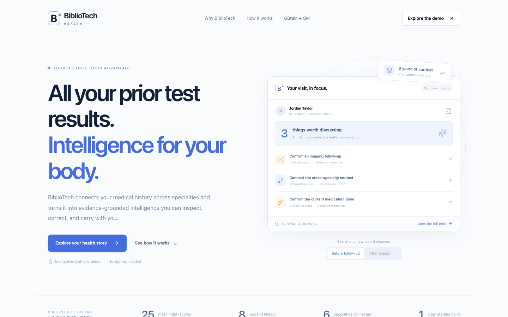
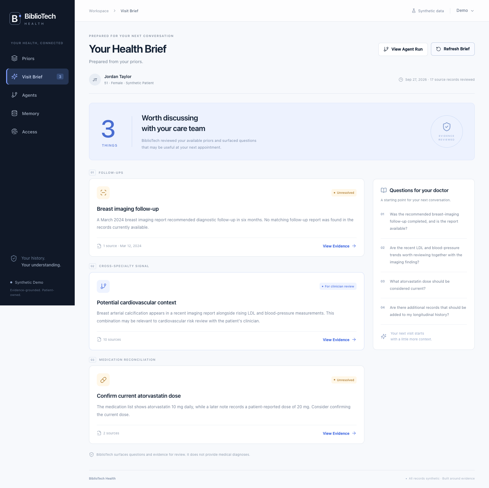
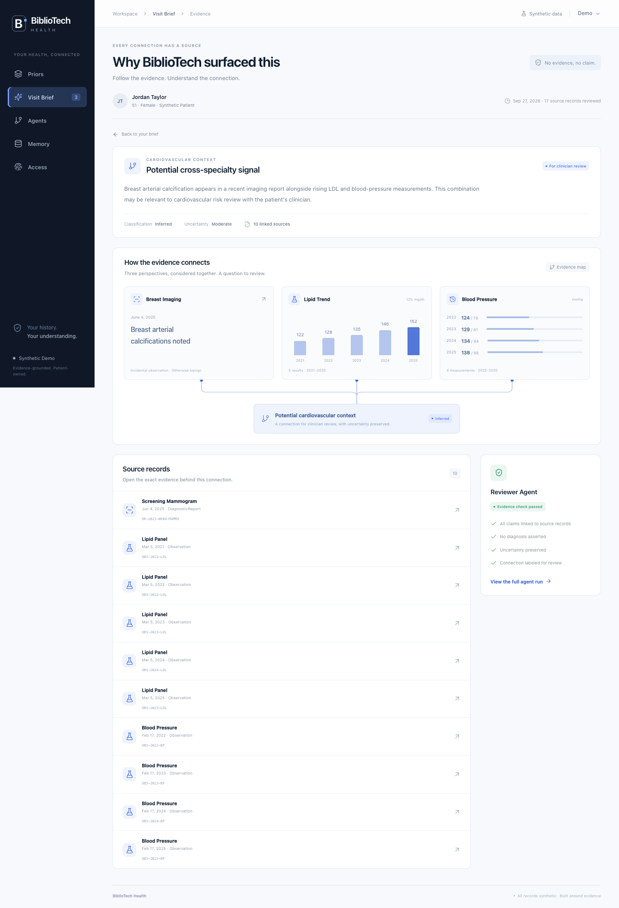

# BiblioTech Health

## All your prior test results. Intelligence for your body.

BiblioTech connects your medical history across specialties and turns it into evidence-grounded intelligence you can inspect, correct, and carry with you.

Explore a connected medical timeline, prepare questions for your next appointment, inspect the evidence behind every finding, and see your brief change when new information arrives.



**[Watch or download the 108-second demo](docs/bibliotech-demo.mp4)** · **[Demo script](docs/hackathon-demo-script.md)** · **[MIT license](LICENSE)**

## What you can do

- **Connect your history:** explore 25 synthetic records spanning eight years and six specialties.
- **Prepare a better conversation:** turn labs, imaging, notes, and medications into a short visit brief.
- **Inspect every finding:** follow evidence links to the underlying FHIR resources and see what remains uncertain.
- **Update the picture:** import a follow-up report, resolve an open question, and prepare an updated brief.
- **Review the process:** inspect workflow decisions, rejected claims, and allowed or denied data requests.

This repository contains the landing page and the complete six-screen demo: **Priors → Visit Brief → Evidence → Agents → Memory → Access**.

## Run locally

Requires **Node.js 22+** and npm.

```sh
git clone https://github.com/fergushurley/bibliotech-health.git
cd bibliotech-health
npm ci
npm run dev
```

Open [http://127.0.0.1:3101](http://127.0.0.1:3101) for the marketing page or [http://127.0.0.1:3101/priors](http://127.0.0.1:3101/priors) for the demo. No credentials are needed for the local workflow. To change the port, use `npm run dev -- --port 3201`.

For a production build running locally:

```sh
npm run build
npm start
```

The server binds to loopback. Records and the access ledger persist in `.data/demo.json`; that directory is excluded from Git.

## Two-minute walkthrough

1. Open **Priors**, filter the timeline, and inspect a source record.
2. Select **Prepare My Visit**. The brief surfaces three questions: an imaging follow-up, cross-specialty cardiovascular context, and an atorvastatin dose discrepancy.
3. Open the cardiovascular **View Evidence** link. Inspect the imaging observation, five lipid results, and four blood-pressure measurements behind the finding.
4. Open **Agents** to inspect the five workflow stages and rejected candidates. In **Access**, inspect the denied Research Agent request, which returned zero records.
5. In **Memory**, select **Import New Record** and import the supplied synthetic follow-up report. It matches the original imaging recommendation and invalidates the old brief.
6. Select **Start Fresh Session**, then **Prepare My Visit** again. The imported report persists and the outdated missing-report question no longer appears.

The supplied patient, Jordan Taylor, and every clinical record are fictional. The import accepts only the supplied fixture, not arbitrary medical uploads.

## GBrain and QM

| Component | Role | Current status |
| --- | --- | --- |
| **GBrain** | Durable, evidence-linked memory across sessions | Real MCP connector implemented. Requires a configured connection; successful writes are independently recalled and verified. |
| **QM** | Repeatable orchestration of the Health Priors workflow | Planned integration. No live QM runtime is connected in this version. |
| **Local workflow** | Timeline, follow-up, medication, cross-specialty, and reviewer stages | Implemented with deterministic rules. No LLM calls. |

The video demonstrates **local record persistence**. It does not demonstrate a live GBrain connection or QM orchestration. Offline tests verify adapter behavior, not access to an external account.

### Connect GBrain

Use a dedicated synthetic-only workspace. Follow the [GBrain memory connection guide](https://gbrain.io/docs/workspace/memory-anywhere): add the workspace’s Memory application to a client with **Full** permission and create a connection.

```sh
cp .env.example .env.local
```

Set the server-only values in `.env.local`:

```dotenv
GBRAIN_TOKEN=your-connection-token
GBRAIN_MCP_URL=https://gbrain.io/mcp
GBRAIN_ENTITY=projects/bibliotech-alternative/demo-jordan-taylor
GBRAIN_WORKSPACE_URL=
```

Keep the token private. The optional workspace URL enables **Open in GBrain**. Restart the server, select **Demo → Check GBrain Connection**, then prepare a brief or select **Sync Memory**.

The adapter discovers `recall`, `remember`, and optional `forget` tools. It validates versioned snapshots against the configured namespace, patient, and evidence IDs. A write succeeds only when a separate recall returns the exact snapshot. Missing permissions, ambiguous tools, malformed responses, and transport failures produce visible errors.

Learn more about the planned orchestration platform in the [QM documentation](https://qm.ycombinator.com/).

### Session and reset behavior

- **Start Fresh Session** clears the current run, preserves records, and recalls GBrain when connected.
- **Reset Demo** restores the 25 local records and clears local run and access history. Remote memory is preserved by default and may restore a previously resolved report on recall.
- **Also reset GBrain demo memory?** requires the explicit checkbox. Only valid snapshots in the configured namespace are expired and verified absent; unrelated workspace memory is not reset.

## Architecture

Built with **Next.js, React, TypeScript, the MCP client SDK, Vitest, and Playwright**.

| Path | Purpose |
| --- | --- |
| `app/landing.tsx`, `app/landing.css` | Responsive marketing page and interactive before/after preview |
| `app/health-app.tsx` | Six product screens, source drawers, evidence graph, and demo controls |
| `app/api/demo/route.ts` | Same-origin API and streamed workflow progress |
| `lib/data.ts` | Synthetic FHIR records and follow-up fixture |
| `lib/domain.ts` | Findings, source requirements, uncertainty checks, and access policy |
| `lib/workflow.ts` | Execution, imports, stale-brief invalidation, and memory synchronization |
| `lib/gbrain.ts` | MCP connection, memory validation, verified writes, and scoped reset |
| `lib/store.ts` | Serialized mutations and atomic local storage |
| `public/fixtures/` | Downloadable synthetic FHIR bundle and import fixture |
| `tests/` | Domain, workflow, adapter, and browser checks |

Counts, timings, reviewer decisions, and access events come from execution. The intentionally unsupported candidates exercise reviewer rules. The denied research request is a policy probe and makes no external research call.

## Verification

```sh
npm test
npm run typecheck
npm run build

# Install the browser once, then run the complete demo walkthrough:
npx playwright install chromium
npm run test:e2e

# Alternatively, use installed Chrome with an isolated test profile:
PLAYWRIGHT_CHANNEL=chrome npm run test:e2e
```

The browser suite starts a separate server on port 3102 with isolated data and GBrain disabled. It verifies source navigation, import and fresh-session behavior, denied access, browser errors, and mobile layout. Actual product screenshots are saved in `docs/screenshots/`.

| Visit brief | Evidence |
| --- | --- |
|  |  |

## Prototype scope

This is a **single-patient synthetic demonstration**, not a production clinical service. It has no multi-user authentication and is not ready for actual patient information. Findings are questions for clinician review, not diagnoses or medication recommendations.

## License

[MIT](LICENSE).
