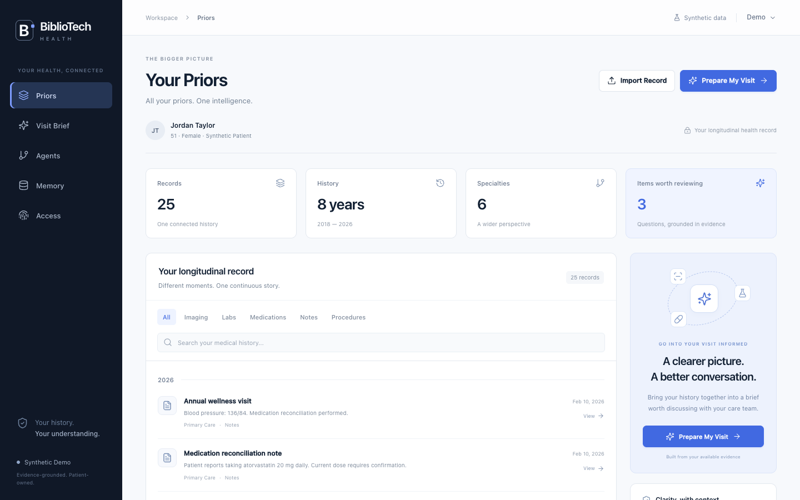
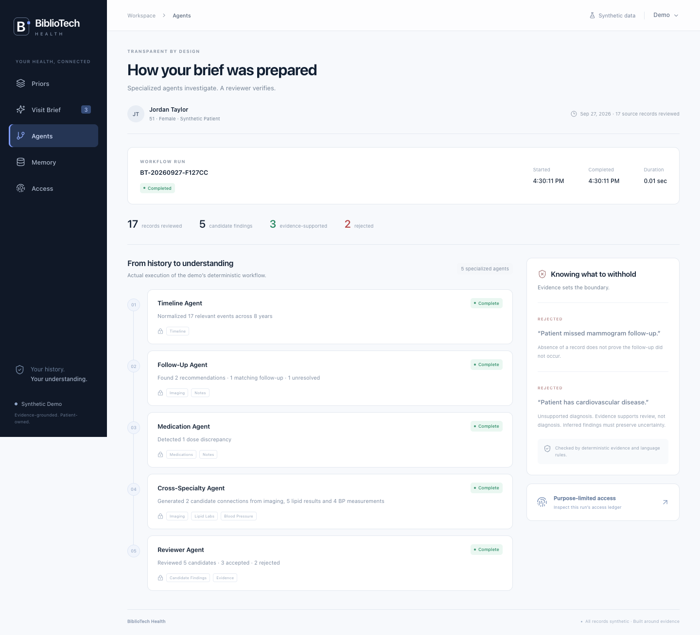
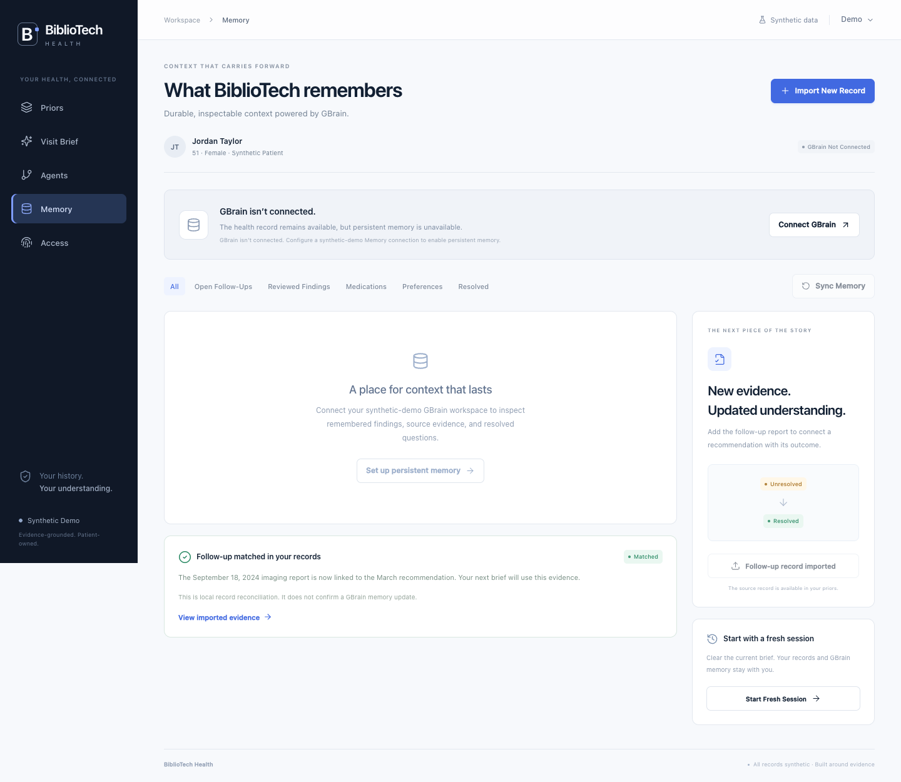
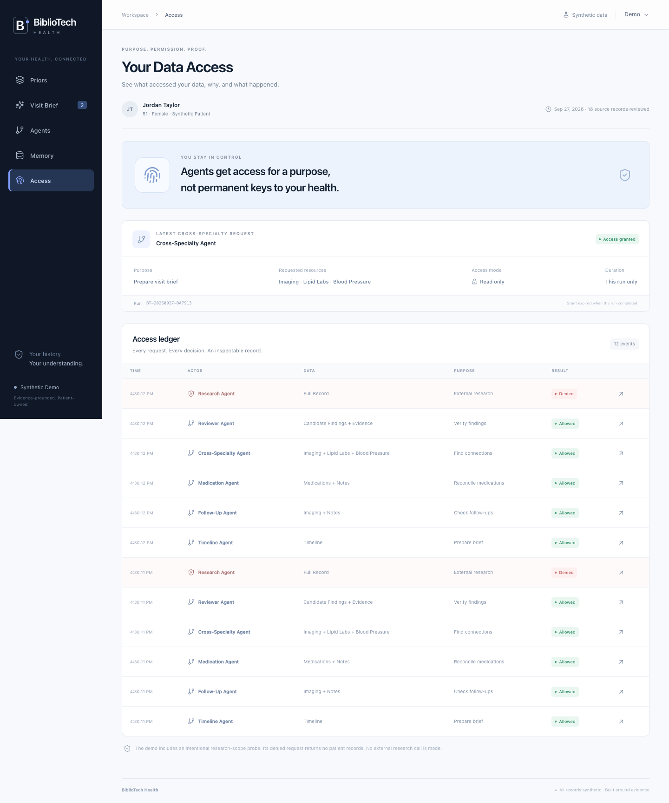

# BiblioTech Health

**All your priors. One intelligence.**

A patient-owned, evidence-grounded health record prototype. This alternative implementation follows the six-screen product specification: Priors, Visit Brief, Evidence, Agents, Memory, and Access.

The only patient is **Jordan Taylor**, a completely fictional 51-year-old woman. All 25 initial records and the import fixture are explicitly synthetic FHIR R4 data. This prototype surfaces questions for review; it does not provide medical diagnoses.

## Run locally

Requires Node.js 22 or newer.

```sh
npm install
npm run dev
```

Open **http://127.0.0.1:3101/priors**. Port 3101 keeps this alternative separate from another local prototype. To use another port, run `npm run dev -- --port 3201`.

```sh
npm test
npm run typecheck
npm run build
npm start
```

This is a single-patient, local demo. Its server binds to loopback. Local FHIR records and the ledger persist in `.data/demo.json`. It is not a multi-user service and has no clinical deployment authentication. Do not put actual patient information into the demo.

## Two-minute walkthrough

1. On **Priors**, inspect a source or filter the 25-record timeline. Select **Prepare My Visit**.
2. The brief contains three evidence-supported questions: imaging follow-up, cross-specialty cardiovascular context, and atorvastatin dose reconciliation.
3. Open the cardiovascular **View Evidence** link. The evidence map connects one imaging report, five lipid results, and four blood-pressure measurements. Every source opens its actual FHIR resource.
4. On **Agents**, inspect the actual run, timestamps, five deterministic steps, and rejected candidates.
5. On **Memory**, import `followup-mammogram-2024-09.json`. The report matches the March recommendation and invalidates the old brief immediately.
6. When GBrain is connected, the structured follow-up memory becomes resolved after a write and an independent recall. Select **Start Fresh Session**, then prepare another brief. The missing-report question no longer appears.
7. Open **Access** and inspect the denied Research Agent request: the policy check returned zero records.

The local workflow also works without GBrain. In that case the app explicitly reports that persistent memory is unavailable. Local record persistence is never presented as proof of a GBrain update.

## Connect real GBrain memory

Use a dedicated synthetic-only GBrain workspace. In GBrain, add that workspace's Memory application to a client with **Full** permission and create a connection. Follow the [official memory connection guide](https://gbrain.io/docs/workspace/memory-anywhere).

Copy `.env.example` to `.env.local`, then set the server-only connection values:

```dotenv
GBRAIN_TOKEN=your-connection-token
GBRAIN_MCP_URL=https://gbrain.io/mcp
GBRAIN_ENTITY=projects/bibliotech-alternative/demo-jordan-taylor
GBRAIN_WORKSPACE_URL=
```

The optional workspace URL enables **Open in GBrain**. Use the actual URL of your synthetic workspace. Restart the server, select **Demo → Check GBrain Connection**, then prepare a brief or select **Sync Memory**.

The adapter uses the MCP client SDK, discovers unambiguous `recall`, `remember`, and optional `forget` tools, and requires successful recall before declaring a connection. Structured versioned snapshots are attributed to this demo's namespace, patient, and evidence IDs. A memory write is successful only after a separate recall returns the exact snapshot. Unknown response shapes, unavailable tools, missing write permissions, and transport errors fail visibly. No simulated GBrain adapter is included in the application.

The protocol adapter is implemented and covered by isolated contract tests. **Live GBrain read/write verification requires a configured connection and is not claimed by offline tests or screenshots.** No QM extension is implemented, so no QM badge is displayed.

### Reset behavior

- **Start Fresh Session** clears the current run while preserving the records and remote memory. It recalls GBrain again.
- **Reset Demo** restores the 25 local records and clears local run and access history. GBrain is preserved by default; a subsequent recall can restore a resolved report.
- **Also reset GBrain demo memory?** requires the explicit checkbox. Only valid snapshots in the configured alternative-demo namespace are expired, using `forget`, then verified absent. Unrelated workspace memory is never reset.

## How it works

- `lib/data.ts`: coherent synthetic records and FHIR resources. The downloadable bundle contains the patient and the 25 initial records.
- `lib/domain.ts`: five conceptual agent responsibilities, exact-purpose access policies, source requirements, uncertainty checks, and unsupported-language rejection.
- `lib/workflow.ts`: actual streamed execution, import matching, stale-brief invalidation, session boundaries, and remote synchronization.
- `lib/gbrain.ts`: real MCP connection, structured memory validation, write/read verification, and namespace-scoped reset.
- `lib/store.ts`: serialized mutations and atomic local writes.
- `app/health-app.tsx`: the six screens, source drawers, filters, evidence map, import, demo controls, and accessible dialogs.

The workflow is deterministic. It does not call an LLM or claim to. Its two intentionally unsupported candidates demonstrate the reviewer rules; the research request is a deliberate policy probe, with no external research call. Timing, record counts, accepted/rejected totals, and the access ledger come from actual execution.

The demo import accepts only the supplied synthetic fixture. It does not ingest arbitrary patient uploads.

## Browser verification and screenshots

```sh
npx playwright install chromium
npm run test:e2e
# Or use an already installed Chrome with an isolated test profile:
PLAYWRIGHT_CHANNEL=chrome npm run test:e2e
```

The browser suite starts an isolated server on port 3102 with a separate data directory and GBrain disabled. It walks through the complete demo, checks source navigation, verifies local persistence after a reload and fresh session, inspects the denied request, checks browser errors, and verifies the phone layout. It captures actual screenshots under `docs/screenshots/`.

| Priors | Visit brief |
|---|---|
|  |  |

| Evidence | Agents |
|---|---|
|  |  |

| Memory — disconnected state | Access ledger |
|---|---|
|  |  |

These are application screenshots, not generated artwork. The memory screenshot must not be used to claim that an external GBrain integration was verified.
